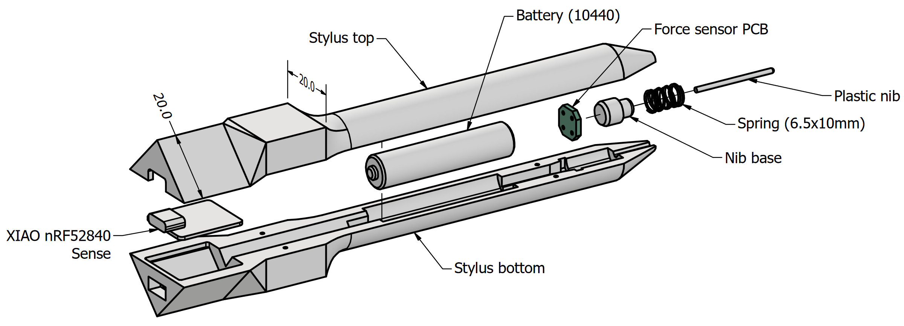

# D-POINT: Digital Pen with Optical-Inertial Tracking

**D-POINT** is an open-source digital stylus that uses camera tracking and inertial measurements to achieve 6DoF (six degrees of freedom) inputs, with low latency, pressure sensitivity, and sub-millimetre accuracy.
The stylus can be used on any flat surface, and works with consumer-grade webcams.

<video src="https://github.com/Jcparkyn/dpoint/assets/51850908/21d00ce3-6456-4fba-8c24-4bc8e6642a0d" width="1920" height="1080" autoplay loop muted></video>

This project was part of my undergraduate thesis for electrical engineering. I've open-sourced the code and design files in the hopes that they might be useful to somebody, but it's not intended to be a "plug and play" DIY project. If you want to try building it anyway, follow the [setup guide](./setup-guide.md).

## Design

This is a very brief overview of how the system works. For all the details, plus literature review and lots of evaluation, read the full thesis (note: I haven't published this online yet).

### Hardware

The main body of the stylus was 3D printed as two halves, shown below. The stylus contains a force sensor, a Li-ion battery which charges over USB-C, and an Arduino-based development board for logic and Bluetooth. Eight printed [ArUco](https://www.uco.es/investiga/grupos/ava/portfolio/aruco/) markers are glued to the back of the stylus, for visual pose estimation.

### Visual pose estimation (VPE)

The VPE process involves the four main steps:
1. **Marker detection:** First, we use OpenCV to detect the corners of each visible ArUco marker on the stylus.
1. **Rolling shutter correction:** We use a simple 2D motion model to estimate and correct for the effects of [rolling shutter](https://en.wikipedia.org/wiki/Rolling_shutter) on the observed corner locations.
1. **Perspective-n-Point (PnP):** From these corner positions, we use a [PnP](https://en.wikipedia.org/wiki/Perspective-n-Point) algorithm to estimate the pose of the stylus relative to the camera. When possible, we use the pose from the previous frame as a starting point to refine with virtual visual servoing (VVS), otherwise we fall back to SQPnP.
1. **Coordinate conversion:** Using the calibrated pose of the stylus and the drawing surface relative to the camera, we calculate the position and orientation of the stylus tip relative to the drawing surface.

### Inertial fusion

We use an Extended Kalman Filter (EKF) to fuse the VPE estimates with the inertial data from the accelerometer and gyroscope, and refine the estimates in real-time using the Rauch-Tung-Striebel (RTS) algorithm. To account for time delay from the camera frames, we use a negative-time measurement update algorithm. The EKF is implemented using NumPy and [Numba](https://numba.pydata.org/).

Using inertial measurements allows us to dramatically reduce latency compared to a camera-only implementation, while also improving accuracy and report rate for fast movements.
