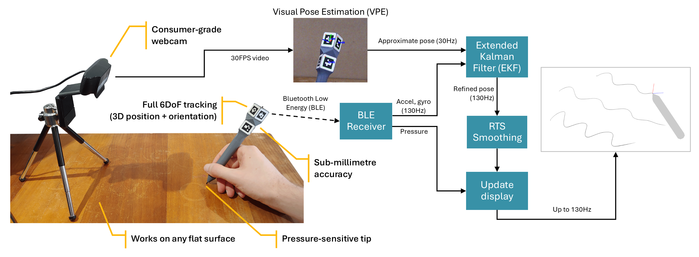

# D-POINT

**Digital Pen with Optical-Inertial Tracking**

D-POINT is an open-source digital stylus that uses camera tracking and inertial measurements to achieve 6DoF (six degrees of freedom) inputs, with low latency, pressure sensitivity, and sub-millimetre accuracy.

This was part of my undergraduate thesis for electrical engineering. I've open-sourced the code and design files in the hopes that they might be useful to somebody, but it's not intended to be a "plug and play" DIY project.

